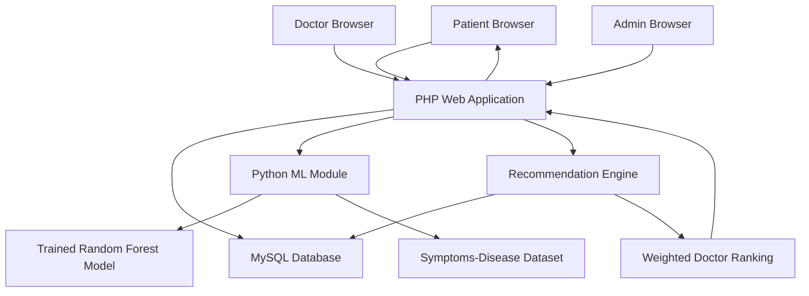
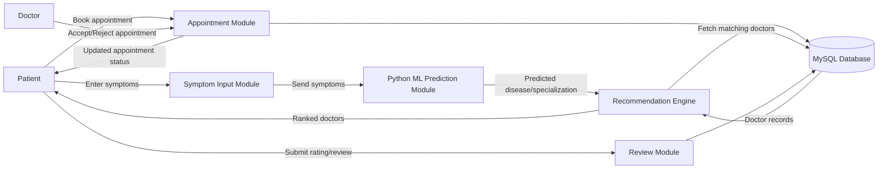
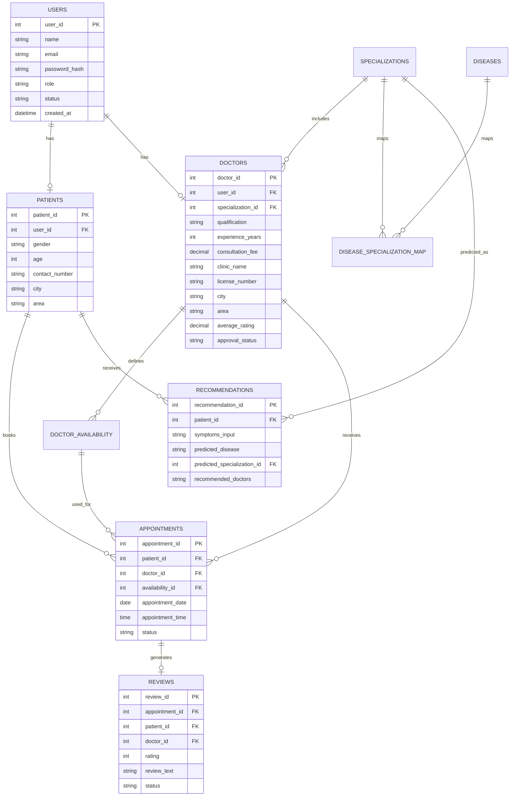

# Functional Requirements Specification (FRS)

## Doctors Recommendation System

**Project Type:** Bachelor’s Final Year Project  
**Document Type:** Functional Requirements Specification  
**Technology Stack:** PHP, HTML, CSS, Python, MySQL, XAMPP  
**Primary Algorithm:** Hybrid Recommendation System using Random Forest Classifier and Weighted Doctor Ranking  
**Version:** 1.0  
**Date:** 2026-06-03  

---

## Table of Contents

1. [Introduction](#1-introduction)
2. [Project Scope](#2-project-scope)
3. [Stakeholders](#3-stakeholders)
4. [System Overview](#4-system-overview)
5. [Technology Stack](#5-technology-stack)
6. [User Roles](#6-user-roles)
7. [Functional Requirements](#7-functional-requirements)
8. [Non-Functional Requirements](#8-non-functional-requirements)
9. [Hybrid Recommendation Algorithm](#9-hybrid-recommendation-algorithm)
10. [Machine Learning Module](#10-machine-learning-module)
11. [Doctor Ranking Algorithm](#11-doctor-ranking-algorithm)
12. [Database Requirements](#12-database-requirements)
13. [Security Requirements](#13-security-requirements)
14. [User Interface Requirements](#14-user-interface-requirements)
15. [System Architecture](#15-system-architecture)
16. [Data Flow Diagram](#16-data-flow-diagram)
17. [Use Case Diagram](#17-use-case-diagram)
18. [Entity Relationship Diagram Overview](#18-entity-relationship-diagram-overview)
19. [Acceptance Criteria](#19-acceptance-criteria)
20. [Assumptions](#20-assumptions)
21. [Limitations](#21-limitations)
22. [Future Enhancements](#22-future-enhancements)
23. [Appendices](#23-appendices)

---

# 1. Introduction

## 1.1 Purpose

The purpose of this Functional Requirements Specification is to define the functional and non-functional requirements for the **Doctors Recommendation System**, a web-based application designed to recommend suitable doctors to patients based on symptoms, predicted disease or specialization, ratings, experience, availability, location, and consultation fee.

This document serves as a formal reference for project development, implementation, testing, evaluation, and final-year academic assessment.

## 1.2 Problem Statement

Patients often face difficulty identifying the correct medical specialist based on their symptoms. Traditional doctor search systems usually require patients to manually search by specialization, location, or hospital, which may be confusing for users who do not know which specialist they need.

The proposed system solves this problem by allowing patients to enter symptoms. The system predicts the likely disease or required medical specialization using a machine learning model and recommends doctors using a hybrid weighted ranking algorithm.

## 1.3 Objectives

The main objectives of the Doctors Recommendation System are:

- To provide a web-based platform for patients, doctors, and administrators.
- To allow patients to enter symptoms and receive doctor recommendations.
- To use a Python-based machine learning model for disease or specialization prediction.
- To rank doctors using a weighted scoring algorithm.
- To allow patients to book appointments with recommended doctors.
- To allow doctors to manage availability and appointment requests.
- To allow patients to rate and review doctors after completed appointments.
- To allow administrators to manage users, doctors, appointments, specializations, symptoms, diseases, and reviews.
- To maintain patient recommendation and appointment history.
- To implement role-based access control and secure data handling.

## 1.4 Intended Audience

This document is intended for:

- Project supervisors
- Final-year project evaluators
- Developers
- Testers
- System administrators
- Academic reviewers
- Future maintainers of the system

---

# 2. Project Scope

## 2.1 In Scope

The system shall include the following features:

- Patient registration and login
- Doctor registration and login
- Admin login
- Admin approval or rejection of doctor registrations
- Patient profile management
- Doctor profile management
- Doctor availability and time-slot management
- Symptom-based recommendation
- Machine learning-based disease or specialization prediction
- Weighted doctor ranking
- Manual doctor search and filtering
- Appointment booking
- Appointment approval or rejection by doctors
- Appointment status management
- Patient recommendation history
- Patient appointment history
- Doctor access to appointment-related patient recommendation details
- Ratings and reviews after completed appointments
- Admin management of users, doctors, appointments, reviews, symptoms, diseases, and specializations
- Security features such as password hashing, session-based authentication, input validation, and SQL injection prevention

## 2.2 Out of Scope

The following features are not included in the current system scope:

- Online payment processing
- SMS notifications
- Email notifications
- Emergency medical diagnosis
- Real-time doctor consultation
- Video consultation
- Mobile application
- Hospital management system
- Electronic prescription generation
- Insurance claim processing

---

# 3. Stakeholders

| Stakeholder | Description |
|---|---|
| Patient | Uses the system to enter symptoms, receive doctor recommendations, book appointments, and provide reviews. |
| Doctor | Registers in the system, manages profile and availability, and accepts or rejects appointments. |
| Admin | Manages doctors, patients, appointments, reviews, symptoms, diseases, and specializations. |
| Developer | Builds, tests, and maintains the system. |
| Project Supervisor | Reviews and evaluates the project during academic assessment. |
| Institution | Uses the project for academic evaluation. |

---

# 4. System Overview

The Doctors Recommendation System is a web-based application developed using PHP, HTML, CSS, MySQL, and Python. It runs locally using XAMPP, where Apache serves the PHP application and MySQL stores system data.

The system uses a hybrid recommendation approach:

1. The patient enters symptoms.
2. PHP sends the symptoms to a Python script or lightweight Python API.
3. Python processes the symptoms using a trained Random Forest Classifier.
4. The machine learning model predicts the probable disease or required specialization.
5. PHP retrieves doctors matching the predicted specialization from MySQL.
6. The system ranks doctors using a weighted scoring algorithm.
7. The patient views ranked doctor recommendations.
8. The patient books an appointment with a selected doctor.
9. The doctor accepts or rejects the appointment.
10. After completion, the patient can rate and review the doctor.

---

# 5. Technology Stack

| Layer | Technology |
|---|---|
| Frontend | HTML, CSS |
| Backend | PHP |
| Machine Learning | Python |
| Database | MySQL |
| Local Server Environment | XAMPP |
| Web Server | Apache |
| ML Libraries | scikit-learn, pandas, numpy |
| Database Access | PHP MySQLi or PDO |
| Optional API Layer | Flask or direct Python script execution |

---

# 6. User Roles

The system shall support three primary user roles:

## 6.1 Patient

A patient can:

- Register and login
- Manage profile
- Enter symptoms
- Receive doctor recommendations
- Search and filter doctors manually
- Book appointments
- View appointment history
- View recommendation history
- Rate and review doctors after completed appointments

## 6.2 Doctor

A doctor can:

- Register in the system
- Wait for admin approval
- Login after approval
- Manage profile
- Set specialization, experience, fees, location, and availability
- Manage available days and time slots
- View appointment requests
- Accept or reject appointments
- View appointment-related patient recommendation details

## 6.3 Admin

An admin can:

- Login to the admin dashboard
- Approve or reject doctor registrations
- Manage patients
- Manage doctors
- Manage specializations
- Manage symptoms
- Manage diseases
- Manage disease-specialization mappings
- Monitor appointments
- Remove inappropriate reviews
- View system statistics and records

---

# 7. Functional Requirements

## 7.1 Authentication and Authorization

### FR-001: Patient Registration

The system shall allow patients to register by providing required details such as name, email, password, contact number, gender, age, city, and area.

**Priority:** High  
**Actor:** Patient  

**Acceptance Criteria:**

- The patient can submit a registration form with valid data.
- The system validates required fields.
- The system prevents duplicate email registration.
- The password is stored using secure hashing.
- The patient can login after successful registration.

---

### FR-002: Patient Login

The system shall allow registered patients to login using email and password.

**Priority:** High  
**Actor:** Patient  

**Acceptance Criteria:**

- The patient can login using valid credentials.
- The system rejects invalid credentials.
- The system creates a secure session after login.
- The patient is redirected to the patient dashboard.

---

### FR-003: Doctor Registration

The system shall allow doctors to register by providing professional and personal details.

Required doctor details may include:

- Full name
- Email
- Password
- Contact number
- Specialization
- Qualification
- Experience
- Consultation fee
- City
- Area
- Clinic or hospital name
- License or registration number

**Priority:** High  
**Actor:** Doctor  

**Acceptance Criteria:**

- The doctor can submit a registration form.
- The system stores the doctor account with `Pending` approval status.
- The doctor cannot access the dashboard until approved by admin.
- The admin can approve or reject the registration.

---

### FR-004: Doctor Login

The system shall allow approved doctors to login.

**Priority:** High  
**Actor:** Doctor  

**Acceptance Criteria:**

- Approved doctors can login using valid credentials.
- Pending or rejected doctors cannot access the doctor dashboard.
- The system displays an appropriate message for unapproved accounts.

---

### FR-005: Admin Login

The system shall allow admin users to login securely.

**Priority:** High  
**Actor:** Admin  

**Acceptance Criteria:**

- Admin can login using valid credentials.
- The system creates an admin session.
- Admin is redirected to the admin dashboard.
- Unauthorized users cannot access admin pages.

---

### FR-006: Role-Based Access Control

The system shall restrict access based on user roles.

**Priority:** High  
**Actors:** Patient, Doctor, Admin  

**Acceptance Criteria:**

- Patients cannot access doctor or admin dashboards.
- Doctors cannot access patient or admin dashboards.
- Admin can access administrative modules only.
- Unauthorized access attempts are blocked.

---

## 7.2 Patient Module

### FR-007: Manage Patient Profile

The system shall allow patients to update their profile information.

**Priority:** Medium  
**Actor:** Patient  

**Acceptance Criteria:**

- The patient can update editable profile fields.
- The system validates updated data.
- The updated profile is stored in the database.

---

### FR-008: Enter Symptoms

The system shall allow patients to enter symptoms through a symptom input page.

**Priority:** High  
**Actor:** Patient  

**Acceptance Criteria:**

- The patient can select or enter one or more symptoms.
- The system validates symptom input.
- The entered symptoms are sent to the Python ML module.
- The symptoms are stored in the recommendation history.

---

### FR-009: View Recommended Doctors

The system shall display ranked doctor recommendations based on predicted specialization and doctor ranking score.

**Priority:** High  
**Actor:** Patient  

**Acceptance Criteria:**

- The patient receives a predicted disease or specialization.
- The system displays doctors matching the predicted specialization.
- Doctors are sorted by weighted final score.
- The patient can view doctor name, specialization, rating, experience, availability, location, and fee.

---

### FR-010: Manual Doctor Search and Filtering

The system shall allow patients to search and filter doctors manually.

Filters shall include:

- Specialization
- City or area
- Rating
- Experience
- Consultation fee
- Availability

**Priority:** Medium  
**Actor:** Patient  

**Acceptance Criteria:**

- The patient can search doctors manually.
- The patient can apply filters.
- The system displays matching doctors.
- Search results are updated according to selected filters.

---

### FR-011: Book Appointment

The system shall allow patients to book appointments with available doctors.

**Priority:** High  
**Actor:** Patient  

**Acceptance Criteria:**

- The patient can select a doctor.
- The patient can select an available date and time slot.
- The system prevents booking unavailable slots.
- The appointment is created with `Pending` status.
- The appointment appears in the patient appointment history.

---

### FR-012: View Appointment History

The system shall allow patients to view their appointment history.

**Priority:** Medium  
**Actor:** Patient  

**Acceptance Criteria:**

- The patient can view previous and upcoming appointments.
- Appointment status is visible.
- Appointment details include doctor, date, time, and status.

---

### FR-013: View Recommendation History

The system shall allow patients to view previous recommendation records.

**Priority:** Medium  
**Actor:** Patient  

**Acceptance Criteria:**

- The patient can view previous symptoms entered.
- The patient can view predicted disease or specialization.
- The patient can view recommended doctors from previous sessions.

---

### FR-014: Submit Rating and Review

The system shall allow patients to rate and review doctors after completed appointments.

**Priority:** Medium  
**Actor:** Patient  

**Acceptance Criteria:**

- The patient can submit a rating only after a completed appointment.
- The patient can submit a textual review.
- The system stores the review.
- The doctor’s average rating is updated.
- Ratings are used in future doctor ranking.

---

## 7.3 Doctor Module

### FR-015: Manage Doctor Profile

The system shall allow approved doctors to update their professional profile.

**Priority:** Medium  
**Actor:** Doctor  

**Acceptance Criteria:**

- The doctor can update profile details.
- The doctor can update specialization, experience, fee, location, and clinic information.
- The system validates submitted data.

---

### FR-016: Manage Availability

The system shall allow doctors to set available days and time slots.

**Priority:** High  
**Actor:** Doctor  

**Acceptance Criteria:**

- The doctor can add available days.
- The doctor can add available time slots.
- The doctor can update or remove availability.
- Patients can book only available slots.

---

### FR-017: View Appointment Requests

The system shall allow doctors to view appointment requests from patients.

**Priority:** High  
**Actor:** Doctor  

**Acceptance Criteria:**

- The doctor can view pending appointment requests.
- The doctor can view patient name and appointment details.
- The doctor can view appointment-related recommendation details only for patients who booked with them.

---

### FR-018: Accept or Reject Appointments

The system shall allow doctors to accept or reject appointment requests.

**Priority:** High  
**Actor:** Doctor  

**Acceptance Criteria:**

- The doctor can accept a pending appointment.
- The doctor can reject a pending appointment.
- The appointment status is updated accordingly.
- Rejected slots become available again.

---

### FR-019: Mark Appointment as Completed

The system shall allow doctors or admin to mark an appointment as completed after consultation.

**Priority:** Medium  
**Actor:** Doctor, Admin  

**Acceptance Criteria:**

- Completed appointments are marked with `Completed` status.
- Patients can review doctors only after completion.
- Completed appointments remain in history.

---

## 7.4 Admin Module

### FR-020: Approve or Reject Doctor Registration

The system shall allow admin to approve or reject doctor registration requests.

**Priority:** High  
**Actor:** Admin  

**Acceptance Criteria:**

- Admin can view pending doctor registrations.
- Admin can approve a valid doctor account.
- Admin can reject an invalid doctor account.
- Approved doctors can login.
- Rejected doctors cannot access the doctor dashboard.

---

### FR-021: Manage Patients

The system shall allow admin to manage patient accounts.

**Priority:** Medium  
**Actor:** Admin  

**Acceptance Criteria:**

- Admin can view patient records.
- Admin can update or deactivate patient accounts.
- Admin can remove invalid or fake patient accounts.

---

### FR-022: Manage Doctors

The system shall allow admin to manage doctor records.

**Priority:** High  
**Actor:** Admin  

**Acceptance Criteria:**

- Admin can view approved, pending, and rejected doctors.
- Admin can update doctor status.
- Admin can remove inactive or invalid doctors.

---

### FR-023: Manage Specializations

The system shall allow admin to manage medical specializations.

**Priority:** Medium  
**Actor:** Admin  

**Acceptance Criteria:**

- Admin can add new specialization records.
- Admin can update specialization records.
- Admin can delete unused specialization records.

---

### FR-024: Manage Symptoms, Diseases, and Mappings

The system shall allow admin to manage symptoms, diseases, and disease-specialization mappings.

**Priority:** Medium  
**Actor:** Admin  

**Acceptance Criteria:**

- Admin can add, update, or delete symptoms.
- Admin can add, update, or delete diseases.
- Admin can map diseases to medical specializations.
- ML model training is handled separately in Python.

---

### FR-025: Monitor Appointments

The system shall allow admin to monitor appointment records.

**Priority:** Medium  
**Actor:** Admin  

**Acceptance Criteria:**

- Admin can view all appointments.
- Admin can filter appointments by status.
- Admin can view appointment details.

---

### FR-026: Manage Reviews

The system shall allow admin to remove inappropriate reviews.

**Priority:** Medium  
**Actor:** Admin  

**Acceptance Criteria:**

- Admin can view doctor reviews.
- Admin can remove offensive, fake, or inappropriate reviews.
- Removed reviews no longer affect doctor rating.

---

## 7.5 Recommendation Module

### FR-027: Predict Disease or Specialization

The system shall use a Python-based machine learning model to predict disease or required specialization from symptoms.

**Priority:** High  
**Actor:** System  

**Acceptance Criteria:**

- PHP sends patient symptoms to the Python module.
- Python processes the symptoms using the trained Random Forest Classifier.
- Python returns predicted disease and/or specialization to PHP.
- The prediction result is stored in the recommendation history.

---

### FR-028: Rank Recommended Doctors

The system shall rank doctors using a weighted scoring algorithm.

**Priority:** High  
**Actor:** System  

**Acceptance Criteria:**

- The system retrieves doctors matching the predicted specialization.
- The system calculates scores using specialization match, rating, experience, availability, location match, and consultation fee.
- The system sorts doctors by final score in descending order.
- The highest-ranked doctors appear first.

---

# 8. Non-Functional Requirements

## 8.1 Performance

| Requirement ID | Requirement |
|---|---|
| NFR-001 | The system should load standard pages within 3 seconds on a local XAMPP environment. |
| NFR-002 | The recommendation result should be generated within 5 seconds for normal input. |
| NFR-003 | Database queries should be optimized using primary keys and indexes. |

## 8.2 Usability

| Requirement ID | Requirement |
|---|---|
| NFR-004 | The user interface should be simple and understandable for patients with basic computer knowledge. |
| NFR-005 | Forms should include validation messages. |
| NFR-006 | Navigation should be role-specific and clear. |

## 8.3 Reliability

| Requirement ID | Requirement |
|---|---|
| NFR-007 | The system should maintain accurate appointment status. |
| NFR-008 | The system should prevent duplicate appointment booking for the same doctor slot. |
| NFR-009 | The system should handle invalid symptom input gracefully. |

## 8.4 Maintainability

| Requirement ID | Requirement |
|---|---|
| NFR-010 | PHP code should be modular and separated by functionality. |
| NFR-011 | Python ML code should be separated from PHP application logic. |
| NFR-012 | Database table names and column names should follow consistent naming conventions. |

## 8.5 Compatibility

| Requirement ID | Requirement |
|---|---|
| NFR-013 | The system should run on XAMPP with Apache, PHP, and MySQL. |
| NFR-014 | The system should work on modern browsers such as Chrome, Edge, and Firefox. |
| NFR-015 | Python dependencies should be documented in a requirements file. |

## 8.6 Privacy

| Requirement ID | Requirement |
|---|---|
| NFR-016 | Patient medical and recommendation history should be visible only to authorized users. |
| NFR-017 | Doctors should only view patient recommendation details related to appointments booked with them. |
| NFR-018 | Admin access should be restricted to authenticated admin users only. |

---

# 9. Hybrid Recommendation Algorithm

The system shall use a hybrid recommendation approach combining:

1. **Symptom-based prediction**
2. **Specialization matching**
3. **Weighted doctor ranking**

## 9.1 Hybrid Recommendation Process

The recommendation process shall follow these steps:

1. Patient enters symptoms.
2. Symptoms are preprocessed.
3. Python ML model predicts probable disease.
4. Predicted disease is mapped to medical specialization.
5. PHP retrieves doctors from MySQL based on specialization.
6. Weighted ranking score is calculated for each doctor.
7. Doctors are sorted by final score.
8. Ranked doctors are displayed to the patient.
9. Recommendation record is stored in the database.

## 9.2 Recommendation Inputs

| Input | Description |
|---|---|
| Symptoms | Symptoms entered or selected by the patient. |
| Patient city/area | Used for location matching. |
| Doctor specialization | Used for specialization matching. |
| Doctor rating | Used for quality-based ranking. |
| Doctor experience | Used for professional experience ranking. |
| Doctor availability | Used to prioritize available doctors. |
| Consultation fee | Used to prefer affordable doctors. |

## 9.3 Recommendation Output

The system shall output:

- Predicted disease
- Recommended medical specialization
- Ranked list of doctors
- Doctor profile summary
- Appointment booking option

## 9.4 Hybrid Approach Classification

In recommender systems terminology, the Doctors Recommendation System implements a **hybrid recommendation approach** combining two distinct paradigms:

| Component | Paradigm | Description |
|---|---|---|
| Symptom-to-disease prediction | Content-based filtering | Uses patient symptom features (item content) to predict the required specialization. No prior appointment history is required. |
| Doctor ranking | Utility-based filtering | Ranks doctors by a weighted utility function over observable attributes (rating, experience, availability, location, fee). |

This hybrid design is chosen because:

- **Content-based prediction** handles the cold-start problem for new patients — no prior appointment or interaction history is required to generate a recommendation.
- **Utility-based ranking** personalizes results to the patient's location and fee preferences without requiring a user-item interaction matrix or collaborative data.

### 9.4.1 Cold Start Consideration

A new doctor with no reviews will receive an `average_rating` of 0, resulting in a rating score of 0 in the ranking formula. This is a known cold-start limitation of utility-based ranking. The system partially mitigates this through the experience weight (15%), which provides a non-zero score for new but experienced doctors. Administrators are expected to seed initial rating data or approve only doctors with verifiable credentials.

---

# 10. Machine Learning Module

## 10.1 Purpose

The purpose of the machine learning module is to predict the probable disease or medical specialization based on patient symptoms.

## 10.2 Primary Algorithm

The primary machine learning algorithm shall be:

> **Random Forest Classifier**

### 10.2.1 Formal Definition

A Random Forest is an ensemble of T decision trees `{h₁(x), h₂(x), ..., hₜ(x)}`, each trained independently on a bootstrap sample drawn with replacement from the training dataset. The final predicted class is determined by majority vote:

```
ŷ = argmax_c  Σ(t=1 to T)  I(hₜ(x) = c)
```

where `I(·)` is the indicator function and `c` is a candidate disease class.

### 10.2.2 Node Splitting Criterion

Each decision tree node is split using the **Gini Impurity** criterion:

```
Gini(t) = 1 - Σ p²(c|t)
```

where `p(c|t)` is the proportion of training samples belonging to class `c` at node `t`. The algorithm selects the feature and threshold that minimizes the weighted Gini impurity of the resulting child nodes.

### 10.2.3 Justification for Selection

Random Forest is selected over alternative classifiers for the following reasons:

| Property | Explanation |
|---|---|
| Overfitting resistance | Averaging over T trees reduces variance introduced by any single decision tree. |
| High-dimensional sparse input | Each tree evaluates a random subset of √N features per split, making it well-suited for binary symptom vectors. |
| Non-linearity | Captures non-linear relationships between symptom combinations and diseases without requiring feature scaling. |
| Feature importance | Provides interpretable feature importance scores via mean decrease in Gini impurity, useful for academic analysis and dataset validation. |
| Robustness to noise | Bootstrap aggregation (bagging) reduces sensitivity to individual noisy or incorrectly entered symptoms. |

## 10.3 Algorithm Comparison

Three candidate classifiers were evaluated for the symptom-to-disease prediction task. The comparison is summarized below:

| Criterion | Random Forest | Decision Tree | Naive Bayes |
|---|---|---|---|
| Overfitting resistance | High — ensemble averaging reduces variance | Low — single tree prone to overfitting | Medium — generative model with smoothing |
| Handles correlated features | Yes — random feature subsets break correlation | No — greedy splits exploit correlation | No — assumes full feature independence |
| Handles sparse binary input | Yes | Yes | Yes |
| Interpretability | Medium — feature importance scores available | High — tree structure is visualizable | High — posterior probabilities are explicit |
| Typical accuracy on tabular data | High | Medium | Low–Medium |
| Training time | Moderate (T × single tree) | Fast | Fast |
| Prediction time | Moderate (T tree traversals) | Fast (single traversal) | Fast (probability computation) |
| Handles class imbalance | Yes — via `class_weight='balanced'` | Partial | Partial |

**Selection conclusion:** Random Forest is selected as the primary algorithm because it achieves the highest expected accuracy on the binary-feature symptom dataset while providing strong overfitting resistance through ensemble averaging. Decision Tree is retained as a baseline for interpretability analysis and accuracy comparison. Naive Bayes serves as a lower-bound baseline; its conditional independence assumption is violated by correlated symptom combinations (e.g., fever and cough co-occurring in respiratory diseases), making it less suitable as a primary classifier.

## 10.4 Dataset

The system shall use a predefined symptoms-disease dataset for model training.

The dataset may contain:

- Symptom columns or symptom features
- Disease labels
- Disease-specialization mappings

## 10.5 Feature Encoding

Patient symptom input shall be encoded as a **binary multi-hot vector** of fixed length N, where N is the total number of distinct symptoms in the training dataset.

For each symptom `sᵢ` in the symptom vocabulary `S = {s₁, s₂, ..., sₙ}`:

```
x[i] = 1   if symptom sᵢ is present in the patient input
x[i] = 0   otherwise
```

The resulting feature vector `x ∈ {0, 1}ᴺ` is passed directly to the trained Random Forest model for prediction.

**Example:** If the system contains 132 symptoms and the patient reports fever, cough, and headache, the feature vector will have `1` at the three corresponding positions and `0` at all 129 remaining positions.

This encoding is chosen because:
- It is lossless — no symptom information is discarded during transformation.
- It requires no feature scaling or normalization, which is compatible with tree-based models.
- It directly matches the format of standard symptom-disease datasets used in academic literature.

---

## 10.6 Hyperparameter Configuration

The trained Random Forest model shall use the following hyperparameter configuration:

| Hyperparameter | Value | Rationale |
|---|---|---|
| `n_estimators` | 100 | Sufficient ensemble size for stable predictions; returns beyond 200 trees are negligible for this dataset size. |
| `max_depth` | None (unlimited) | Allows full tree growth; overfitting is controlled by ensemble averaging, not depth restriction. |
| `min_samples_split` | 2 | Standard default; dataset is clean and structured with no noise requiring early stopping. |
| `min_samples_leaf` | 1 | Standard default. |
| `max_features` | `'sqrt'` | scikit-learn default for classification — each split considers √N features, reducing inter-tree correlation. |
| `bootstrap` | True | Enables bagging; required for ensemble variance reduction. |
| `random_state` | 42 | Fixed seed ensures reproducibility of training and evaluation results. |
| `class_weight` | `'balanced'` | Compensates for unequal disease class frequencies in the dataset, preventing majority-class bias. |

---

## 10.7 ML Workflow

1. Load symptoms-disease dataset.
2. Preprocess symptoms.
3. Convert symptom data into feature vectors.
4. Split dataset into training and testing sets.
5. Train Random Forest Classifier.
6. Evaluate model accuracy.
7. Save trained model using `pickle` or `joblib`.
8. Load trained model during prediction.
9. Predict disease from patient symptoms.
10. Return predicted result to PHP.

## 10.8 Python-PHP Integration

PHP shall communicate with Python using one of the following approaches:

### Option 1: Direct Python Script Execution

PHP passes symptoms to a Python script using command-line execution.

Example concept:

```php
$output = shell_exec("python predict.py \"fever,cough,headache\"");
```

### Option 2: Lightweight Python API

Python exposes a lightweight API using Flask. PHP sends symptoms through an HTTP request and receives JSON response.

Example JSON response:

```json
{
  "predicted_disease": "Common Cold",
  "recommended_specialization": "General Physician",
  "confidence": 0.87
}
```

For this academic system, either direct Python script execution or a lightweight Python API may be used.

---

## 10.9 Model Evaluation Strategy

The trained model shall be evaluated before deployment using the following methodology:

| Evaluation Step | Specification |
|---|---|
| Train-test split | 80% training, 20% testing — stratified by disease class |
| Cross-validation | 5-fold stratified k-fold cross-validation on the training set |
| Acceptance threshold | Model shall not be used in production if test set accuracy falls below **80%** |
| Primary metric | Weighted F1-score (accounts for class imbalance) |

**Metrics reported:**

- Accuracy
- Precision — macro and weighted average
- Recall — macro and weighted average
- F1-score — macro and weighted average
- Confusion matrix (to identify which disease classes are most misclassified)

Stratified splitting ensures each disease class is proportionally represented in both training and test sets, preventing evaluation bias from class imbalance. Macro-average metrics treat all disease classes equally regardless of frequency; weighted-average metrics reflect real-world distribution.

---

## 10.10 Low Confidence Handling

The trained model returns a confidence score alongside the predicted disease, defined as the maximum class probability from the ensemble:

```
confidence = max_c  P(ŷ = c | x)
```

The system shall apply the following threshold rule:

| Condition | System Behavior |
|---|---|
| Confidence ≥ 0.60 | Proceed with predicted disease and its mapped specialization |
| Confidence < 0.60 | Fall back to "General Physician" specialization and display an advisory notice to the patient |

The 0.60 threshold is a conservative minimum. A well-trained model on a clean symptoms-disease dataset is expected to significantly exceed this threshold for common, well-represented disease patterns. The fallback prevents presenting unreliable predictions as definitive clinical guidance.

---

# 11. Doctor Ranking Algorithm

## 11.0 Formal Classification

The doctor ranking component implements an **Additive Weighted Utility Function**, a well-established technique from the field of **Multi-Criteria Decision Making (MCDM)**. In this model, each candidate doctor is assigned a numerical utility score across multiple independent criteria, and these scores are aggregated into a single comparable value using a linear weighted sum.

This approach is chosen for the following reasons:

| Property | Explanation |
|---|---|
| Linearity and interpretability | The contribution of each factor to the final score is transparent and auditable — a technical evaluator can verify the result manually. |
| Computational efficiency | Scoring N doctors requires O(N) operations, suitable for real-time web response within the 5-second NFR threshold. |
| No interaction history required | Unlike collaborative filtering (which requires a user-item rating matrix) or matrix factorization (which requires dense interaction data), the weighted utility model operates entirely on observable doctor attributes available at registration. |
| Criteria separability | The ranking factors — specialization match, rating, experience, availability, location, fee — represent distinct, non-redundant dimensions of doctor suitability, satisfying the additive independence assumption of the weighted utility model. |

## 11.1 Ranking Formula

After predicting the specialization, doctors shall be ranked using the following weighted scoring formula:

```text
Final Score =
(Specialization Match Score × 0.35) +
(Rating Score × 0.20) +
(Experience Score × 0.15) +
(Availability Score × 0.10) +
(Location Match Score × 0.10) +
(Fee Score × 0.10)
```

## 11.2 Weight Distribution

| Ranking Factor | Weight |
|---|---:|
| Specialization Match | 35% |
| Rating | 20% |
| Experience | 15% |
| Availability | 10% |
| Location Match | 10% |
| Consultation Fee | 10% |
| **Total** | **100%** |

### 11.2.1 Weight Derivation Rationale

The weight assignments reflect the following prioritization logic:

| Factor | Weight | Rationale |
|---|---|---|
| Specialization Match | 35% | A doctor whose specialization does not match the predicted requirement is clinically irrelevant regardless of rating, experience, or any other quality. This is the system's primary clinical filter and therefore carries the highest weight. |
| Rating | 20% | Patient rating is the strongest available proxy for care quality, bedside manner, and treatment effectiveness as perceived by prior patients. It is the primary quality signal after specialization is confirmed. |
| Experience | 15% | Experience correlates with diagnostic competence but exhibits diminishing returns — a doctor with 20 years is not necessarily twice as effective as one with 10 years. Lower weight than rating prevents systematic penalization of younger, highly-rated qualified doctors. |
| Availability | 10% | Availability determines appointment accessibility, not clinical quality. Equal convenience weight with location and fee. |
| Location Match | 10% | Geographic proximity reduces patient travel burden and increases appointment adherence. Equal convenience weight. Not a quality indicator. |
| Consultation Fee | 10% | Affordability is a patient preference factor. Assigned the lowest combined weight to avoid systematically downranking high-quality specialists who charge higher fees. |

## 11.3 Score Components

### 11.3.1 Specialization Match Score

| Condition | Score |
|---|---:|
| Doctor specialization exactly matches predicted specialization | 100 |
| Doctor specialization is related | 60 |
| No match | 0 |

### 11.3.2 Rating Score

Rating score shall be normalized to a 0–100 scale.

```text
Rating Score = (Doctor Average Rating / 5) × 100
```

### 11.3.3 Experience Score

Experience score shall be normalized based on a maximum expected experience value.

```text
Experience Score = min((Doctor Experience / 20) × 100, 100)
```

### 11.3.4 Availability Score

| Condition | Score |
|---|---:|
| Doctor has available slots on selected/preferred date | 100 |
| Doctor has available slots on another upcoming date | 60 |
| Doctor has no available slots | 0 |

### 11.3.5 Location Match Score

The system shall use simple city/area-based location matching.

| Condition | Score |
|---|---:|
| Same area | 100 |
| Same city but different area | 70 |
| Different city | 30 |

### 11.3.6 Consultation Fee Score

Lower consultation fees receive a higher normalized score.

Example:

```text
Fee Score = 100 - ((Doctor Fee - Minimum Fee) / (Maximum Fee - Minimum Fee) × 100)
```

If all doctor fees are equal, the system shall assign a default fee score of 100 to avoid division by zero.

## 11.3.7 Normalization Guarantee

All six component scores are normalized to the range **[0, 100]** before weights are applied. This ensures the weighted sum also falls on a **[0, 100]** scale and that no single component can dominate through scale differences. The final score is computed as:

```
Final Score = Σ (wᵢ × Scoreᵢ)   where Σwᵢ = 1.00  and  0 ≤ Scoreᵢ ≤ 100
```

Consequently, `0 ≤ Final Score ≤ 100`.

## 11.4 Final Ranking

Doctors shall be sorted in descending order by final score.

If two doctors have equal final scores, the system may sort them using:

1. Higher rating
2. Higher experience
3. Earlier availability
4. Lower consultation fee

---

# 12. Database Requirements

The system shall use MySQL as the database management system.

## 12.1 Database Tables Overview

Recommended database tables:

1. `users`
2. `patients`
3. `doctors`
4. `specializations`
5. `symptoms`
6. `diseases`
7. `disease_specialization_map`
8. `doctor_availability`
9. `appointments`
10. `reviews`
11. `recommendations`

---

## 12.2 Table: users

| Field | Type | Description |
|---|---|---|
| user_id | INT, PK, AUTO_INCREMENT | Unique user ID |
| name | VARCHAR(100) | User full name |
| email | VARCHAR(150), UNIQUE | User email |
| password_hash | VARCHAR(255) | Hashed password |
| role | ENUM('patient','doctor','admin') | User role |
| status | ENUM('active','inactive','pending','rejected') | Account status |
| created_at | DATETIME | Account creation date |

---

## 12.3 Table: patients

| Field | Type | Description |
|---|---|---|
| patient_id | INT, PK, AUTO_INCREMENT | Unique patient ID |
| user_id | INT, FK | Linked user ID |
| gender | VARCHAR(20) | Patient gender |
| age | INT | Patient age |
| contact_number | VARCHAR(20) | Contact number |
| city | VARCHAR(100) | Patient city |
| area | VARCHAR(100) | Patient area |

---

## 12.4 Table: doctors

| Field | Type | Description |
|---|---|---|
| doctor_id | INT, PK, AUTO_INCREMENT | Unique doctor ID |
| user_id | INT, FK | Linked user ID |
| specialization_id | INT, FK | Doctor specialization |
| qualification | VARCHAR(150) | Doctor qualification |
| experience_years | INT | Years of experience |
| consultation_fee | DECIMAL(10,2) | Consultation fee |
| clinic_name | VARCHAR(150) | Clinic or hospital name |
| license_number | VARCHAR(100) | Medical license/registration number |
| contact_number | VARCHAR(20) | Contact number |
| city | VARCHAR(100) | Doctor city |
| area | VARCHAR(100) | Doctor area |
| average_rating | DECIMAL(3,2) | Average rating |
| approval_status | ENUM('pending','approved','rejected') | Admin approval status |

---

## 12.5 Table: specializations

| Field | Type | Description |
|---|---|---|
| specialization_id | INT, PK, AUTO_INCREMENT | Unique specialization ID |
| specialization_name | VARCHAR(100) | Specialization name |
| description | TEXT | Specialization description |

---

## 12.6 Table: symptoms

| Field | Type | Description |
|---|---|---|
| symptom_id | INT, PK, AUTO_INCREMENT | Unique symptom ID |
| symptom_name | VARCHAR(100) | Symptom name |
| description | TEXT | Symptom description |

---

## 12.7 Table: diseases

| Field | Type | Description |
|---|---|---|
| disease_id | INT, PK, AUTO_INCREMENT | Unique disease ID |
| disease_name | VARCHAR(100) | Disease name |
| description | TEXT | Disease description |

---

## 12.8 Table: disease_specialization_map

| Field | Type | Description |
|---|---|---|
| map_id | INT, PK, AUTO_INCREMENT | Unique mapping ID |
| disease_id | INT, FK | Disease ID |
| specialization_id | INT, FK | Specialization ID |

---

## 12.9 Table: doctor_availability

| Field | Type | Description |
|---|---|---|
| availability_id | INT, PK, AUTO_INCREMENT | Unique availability ID |
| doctor_id | INT, FK | Doctor ID |
| available_day | VARCHAR(20) | Available day |
| start_time | TIME | Start time |
| end_time | TIME | End time |
| slot_status | ENUM('available','booked','inactive') | Slot status |

---

## 12.10 Table: appointments

| Field | Type | Description |
|---|---|---|
| appointment_id | INT, PK, AUTO_INCREMENT | Unique appointment ID |
| patient_id | INT, FK | Patient ID |
| doctor_id | INT, FK | Doctor ID |
| availability_id | INT, FK | Selected time slot |
| appointment_date | DATE | Appointment date |
| appointment_time | TIME | Appointment time |
| status | ENUM('pending','approved','rejected','completed','cancelled') | Appointment status |
| created_at | DATETIME | Booking date |

---

## 12.11 Table: reviews

| Field | Type | Description |
|---|---|---|
| review_id | INT, PK, AUTO_INCREMENT | Unique review ID |
| appointment_id | INT, FK | Appointment ID |
| patient_id | INT, FK | Patient ID |
| doctor_id | INT, FK | Doctor ID |
| rating | INT | Rating from 1 to 5 |
| review_text | TEXT | Review message |
| status | ENUM('active','removed') | Review status |
| created_at | DATETIME | Review date |

---

## 12.12 Table: recommendations

| Field | Type | Description |
|---|---|---|
| recommendation_id | INT, PK, AUTO_INCREMENT | Unique recommendation ID |
| patient_id | INT, FK | Patient ID |
| symptoms_input | TEXT | Symptoms entered by patient |
| predicted_disease | VARCHAR(100) | Predicted disease |
| predicted_specialization_id | INT, FK | Predicted specialization |
| recommended_doctors | TEXT or JSON | Ranked doctors list |
| created_at | DATETIME | Recommendation date |

---

# 13. Security Requirements

## 13.1 Password Security

- The system shall store passwords using secure hashing.
- Plain-text passwords shall not be stored.
- PHP `password_hash()` and `password_verify()` should be used.

## 13.2 Session Security

- The system shall use session-based authentication.
- Session variables shall identify authenticated users and roles.
- Logout shall destroy the active session.

## 13.3 Role-Based Access Control

- Each protected page shall verify the user role.
- Unauthorized users shall be redirected to login or access-denied pages.

## 13.4 SQL Injection Prevention

- The system shall use prepared statements through PDO or MySQLi.
- User input shall not be directly concatenated into SQL queries.

## 13.5 Input Validation

- The system shall validate required fields.
- The system shall sanitize user input.
- The system shall validate numeric fields such as age, fee, experience, and rating.

## 13.6 Data Privacy

- Patient recommendation history shall be private.
- Doctors shall only view medical/recommendation details related to their own appointment patients.
- Admin shall access data only for management purposes.

---

# 14. User Interface Requirements

The system shall include the following pages or screens:

## 14.1 Public Pages

| Page | Description |
|---|---|
| Home Page | Displays project introduction and navigation. |
| Patient Login Page | Allows patient login. |
| Patient Registration Page | Allows patient registration. |
| Doctor Login Page | Allows doctor login. |
| Doctor Registration Page | Allows doctor registration. |
| Admin Login Page | Allows admin login. |

## 14.2 Patient Pages

| Page | Description |
|---|---|
| Patient Dashboard | Shows patient features and summary. |
| Profile Management Page | Allows patient profile update. |
| Symptom Input Page | Allows patient to enter symptoms. |
| Recommendation Results Page | Shows predicted specialization and ranked doctors. |
| Manual Search Page | Allows manual doctor search and filtering. |
| Appointment Booking Page | Allows appointment slot selection. |
| Appointment History Page | Shows appointment records. |
| Recommendation History Page | Shows previous recommendation records. |
| Review Page | Allows review after completed appointment. |

## 14.3 Doctor Pages

| Page | Description |
|---|---|
| Doctor Dashboard | Shows doctor summary and requests. |
| Profile Management Page | Allows doctor profile update. |
| Availability Management Page | Allows doctor to manage days and slots. |
| Appointment Requests Page | Shows pending appointment requests. |
| Appointment History Page | Shows approved, rejected, completed, and cancelled appointments. |

## 14.4 Admin Pages

| Page | Description |
|---|---|
| Admin Dashboard | Shows administrative summary. |
| Doctor Approval Page | Allows admin to approve or reject doctors. |
| Manage Doctors Page | Allows doctor record management. |
| Manage Patients Page | Allows patient record management. |
| Manage Specializations Page | Allows specialization management. |
| Manage Symptoms Page | Allows symptom management. |
| Manage Diseases Page | Allows disease management. |
| Manage Appointments Page | Allows appointment monitoring. |
| Manage Reviews Page | Allows review moderation. |

---

# 15. System Architecture



## 15.1 Architecture Description

The system follows a modular web-based architecture:

- Users access the system through a browser.
- PHP handles authentication, dashboards, appointments, and database operations.
- MySQL stores application data.
- Python handles machine learning prediction.
- The recommendation engine combines ML prediction with weighted doctor ranking.
- XAMPP provides the local Apache and MySQL environment.

---

# 16. Data Flow Diagram



---

# 17. Use Case Diagram

```mermaid
flowchart TD
    Patient((Patient))
    Doctor((Doctor))
    Admin((Admin))

    UC1[Register/Login]
    UC2[Manage Profile]
    UC3[Enter Symptoms]
    UC4[View Recommendations]
    UC5[Search Doctors]
    UC6[Book Appointment]
    UC7[View Appointment History]
    UC8[Rate and Review Doctor]

    UC9[Register as Doctor]
    UC10[Manage Doctor Profile]
    UC11[Manage Availability]
    UC12[View Appointment Requests]
    UC13[Accept/Reject Appointments]

    UC14[Approve/Reject Doctors]
    UC15[Manage Patients]
    UC16[Manage Doctors]
    UC17[Manage Specializations]
    UC18[Manage Symptoms and Diseases]
    UC19[Monitor Appointments]
    UC20[Manage Reviews]

    Patient --> UC1
    Patient --> UC2
    Patient --> UC3
    Patient --> UC4
    Patient --> UC5
    Patient --> UC6
    Patient --> UC7
    Patient --> UC8

    Doctor --> UC9
    Doctor --> UC10
    Doctor --> UC11
    Doctor --> UC12
    Doctor --> UC13

    Admin --> UC14
    Admin --> UC15
    Admin --> UC16
    Admin --> UC17
    Admin --> UC18
    Admin --> UC19
    Admin --> UC20
```



---

# 18. Entity Relationship Diagram Overview



---

# 19. Acceptance Criteria

## 19.1 Patient Module Acceptance Criteria

The patient module shall be accepted when:

- A patient can register and login.
- A patient can manage their profile.
- A patient can enter symptoms.
- A patient can receive disease/specialization prediction.
- A patient can view ranked doctor recommendations.
- A patient can manually search and filter doctors.
- A patient can book appointments only for available slots.
- A patient can view appointment and recommendation history.
- A patient can review a doctor after a completed appointment.

## 19.2 Doctor Module Acceptance Criteria

The doctor module shall be accepted when:

- A doctor can register successfully.
- A doctor account remains pending until admin approval.
- Approved doctors can login.
- Pending or rejected doctors cannot access the dashboard.
- A doctor can manage profile details.
- A doctor can set available days and time slots.
- A doctor can view appointment requests.
- A doctor can accept or reject appointment requests.
- A doctor can view only appointment-related patient recommendation details.

## 19.3 Admin Module Acceptance Criteria

The admin module shall be accepted when:

- Admin can login securely.
- Admin can approve or reject doctor registrations.
- Admin can manage patients and doctors.
- Admin can manage specializations, symptoms, diseases, and mappings.
- Admin can monitor appointments.
- Admin can remove inappropriate reviews.
- Admin pages are inaccessible to unauthorized users.

## 19.4 Recommendation Module Acceptance Criteria

The recommendation module shall be accepted when:

- Symptoms entered by a patient are passed from PHP to Python.
- The Python ML module predicts disease or specialization using Random Forest Classifier.
- The system retrieves doctors matching the predicted specialization.
- The system ranks doctors using the defined weighted scoring formula.
- The ranked results are displayed in descending order.
- Recommendation history is stored for the patient.

## 19.5 Appointment Module Acceptance Criteria

The appointment module shall be accepted when:

- Patients can book only available doctor slots.
- New appointments are stored with `Pending` status.
- Doctors can approve or reject appointments.
- Appointment statuses update correctly.
- Completed appointments allow rating and review.
- Duplicate booking for the same slot is prevented.

---

# 20. Assumptions

The system is based on the following assumptions:

- The system will be deployed locally using XAMPP.
- Apache will be used as the local web server.
- MySQL will be used as the database.
- Python will be installed separately for the ML module.
- A predefined symptoms-disease dataset will be available for model training.
- The quality of prediction depends on dataset quality.
- Doctors will provide accurate professional details.
- Admin will verify doctor registration details before approval.
- Patients will enter symptoms honestly and accurately.
- Consultation fees are displayed for information and ranking only.
- No online payment will be processed.
- No email, SMS, or in-system notification feature is included in the confirmed scope.

---

# 21. Limitations

The system has the following limitations:

- The system is not a replacement for professional medical diagnosis.
- The system does not provide emergency medical support.
- The ML model prediction may be inaccurate if the dataset is incomplete or biased.
- The system does not include online payment.
- The system does not include email or SMS notifications.
- The system does not include real-time chat or video consultation.
- Location matching is based on city/area, not GPS distance.
- The system is designed for local XAMPP deployment, not production cloud deployment.
- ML model training is handled separately in Python and not directly through the web interface.

---

# 22. Future Enhancements

Possible future enhancements include:

- Email notification for appointment status updates
- SMS notification
- Online payment integration
- GPS-based distance calculation
- Real-time chat between patient and doctor
- Video consultation
- Mobile application
- Doctor document verification
- AI chatbot for symptom collection
- Admin analytics dashboard
- Hospital or clinic management integration
- Cloud deployment
- Multi-language support

---

# 23. Appendices

## Appendix A: Appointment Status Values

| Status | Description |
|---|---|
| Pending | Appointment request submitted by patient. |
| Approved | Appointment accepted by doctor. |
| Rejected | Appointment rejected by doctor. |
| Completed | Appointment completed after consultation. |
| Cancelled | Appointment cancelled by patient, doctor, or admin. |

## Appendix B: Doctor Approval Status Values

| Status | Description |
|---|---|
| Pending | Doctor has registered but is waiting for admin approval. |
| Approved | Doctor has been approved and can access the dashboard. |
| Rejected | Doctor registration has been rejected by admin. |

## Appendix C: Review Status Values

| Status | Description |
|---|---|
| Active | Review is visible and included in rating calculation. |
| Removed | Review is removed by admin and excluded from display/rating. |

## Appendix D: Recommendation Worked Example

### Patient Input

```text
Symptoms: fever, cough, headache, body pain
Location: Kathmandu, Baneshwor
```

### Step 1 — ML Prediction Output

```json
{
  "predicted_disease": "Common Cold",
  "recommended_specialization": "General Physician",
  "confidence": 0.87
}
```

Confidence 0.87 ≥ 0.60 → proceed with predicted specialization.

### Step 2 — Candidate Doctors Retrieved

Three doctors with specialization "General Physician" are retrieved from the database:

| Doctor | Rating | Experience | Area | Fee |
|---|---:|---:|---|---:|
| Dr. A | 4.8 | 12 years | Baneshwor | 700 |
| Dr. B | 4.5 | 8 years | Kathmandu | 600 |
| Dr. C | 4.2 | 15 years | Lalitpur | 500 |

### Step 3 — Component Score Calculation

**Specialization Match Score** (all three exactly match → 100 each)

| Doctor | Spec Match Score |
|---|---:|
| Dr. A | 100 |
| Dr. B | 100 |
| Dr. C | 100 |

**Rating Score** = (Rating / 5) × 100

| Doctor | Calculation | Rating Score |
|---|---|---:|
| Dr. A | (4.8 / 5) × 100 | 96.0 |
| Dr. B | (4.5 / 5) × 100 | 90.0 |
| Dr. C | (4.2 / 5) × 100 | 84.0 |

**Experience Score** = min((Years / 20) × 100, 100)

| Doctor | Calculation | Experience Score |
|---|---|---:|
| Dr. A | (12 / 20) × 100 | 60.0 |
| Dr. B | (8 / 20) × 100 | 40.0 |
| Dr. C | (15 / 20) × 100 | 75.0 |

**Availability Score** (assume all have slots on the patient's preferred date → 100 each)

**Location Match Score** (patient is in Baneshwor, Kathmandu)

| Doctor | Location | Score |
|---|---|---:|
| Dr. A | Baneshwor (same area) | 100 |
| Dr. B | Kathmandu (same city, different area) | 70 |
| Dr. C | Lalitpur (different city) | 30 |

**Fee Score** — min fee = 500, max fee = 700

```
Fee Score = 100 - ((Doctor Fee - 500) / (700 - 500)) × 100
```

| Doctor | Calculation | Fee Score |
|---|---|---:|
| Dr. A | 100 - ((700 - 500) / 200) × 100 | 0.0 |
| Dr. B | 100 - ((600 - 500) / 200) × 100 | 50.0 |
| Dr. C | 100 - ((500 - 500) / 200) × 100 | 100.0 |

### Step 4 — Weighted Final Score Calculation

Formula: `(Spec × 0.35) + (Rating × 0.20) + (Experience × 0.15) + (Availability × 0.10) + (Location × 0.10) + (Fee × 0.10)`

**Dr. A:**
```
(100 × 0.35) + (96.0 × 0.20) + (60.0 × 0.15) + (100 × 0.10) + (100 × 0.10) + (0.0 × 0.10)
= 35.0 + 19.2 + 9.0 + 10.0 + 10.0 + 0.0
= 83.2
```

**Dr. B:**
```
(100 × 0.35) + (90.0 × 0.20) + (40.0 × 0.15) + (100 × 0.10) + (70 × 0.10) + (50.0 × 0.10)
= 35.0 + 18.0 + 6.0 + 10.0 + 7.0 + 5.0
= 81.0
```

**Dr. C:**
```
(100 × 0.35) + (84.0 × 0.20) + (75.0 × 0.15) + (100 × 0.10) + (30 × 0.10) + (100.0 × 0.10)
= 35.0 + 16.8 + 11.25 + 10.0 + 3.0 + 10.0
= 86.05
```

### Step 5 — Final Ranked Output

| Rank | Doctor | Final Score |
|---:|---|---:|
| 1 | Dr. C | 86.05 |
| 2 | Dr. A | 83.20 |
| 3 | Dr. B | 81.00 |

**Observation:** Dr. C ranks first despite being in a different city and having a lower rating because the higher experience score (75 vs 60) and the highest fee score (100 vs 0) together outweigh Dr. A's location advantage. This demonstrates the multi-criteria nature of the ranking — no single factor determines the outcome.

---

## Appendix E: Suggested Folder Structure

```text
doctors-recommendation-system/
│
├── index.php
├── config/
│   └── database.php
│
├── assets/
│   ├── css/
│   │   └── style.css
│   └── images/
│
├── patient/
│   ├── dashboard.php
│   ├── symptoms.php
│   ├── recommendations.php
│   ├── appointments.php
│   └── reviews.php
│
├── doctor/
│   ├── dashboard.php
│   ├── profile.php
│   ├── availability.php
│   └── appointments.php
│
├── admin/
│   ├── dashboard.php
│   ├── manage_doctors.php
│   ├── manage_patients.php
│   ├── manage_specializations.php
│   ├── manage_symptoms.php
│   ├── manage_diseases.php
│   └── manage_reviews.php
│
├── auth/
│   ├── login.php
│   ├── register_patient.php
│   ├── register_doctor.php
│   └── logout.php
│
├── ml/
│   ├── train_model.py
│   ├── predict.py
│   ├── model.pkl
│   ├── dataset.csv
│   └── requirements.txt
│
└── database/
    └── doctors_recommendation_system.sql
```

---

## Appendix F: Suggested Python Dependencies

```text
pandas
numpy
scikit-learn
joblib
flask
```

`flask` is required only if the project uses a lightweight Python API instead of direct script execution.

---

## Appendix G: Suggested Evaluation Metrics for ML Model

The machine learning model may be evaluated using:

- Accuracy
- Precision
- Recall
- F1-score
- Confusion matrix

---

## Appendix H: Summary

The Doctors Recommendation System is an academic web-based application that combines PHP-based web development with Python-based machine learning. The system recommends doctors by predicting the required medical specialization from patient symptoms using a Random Forest Classifier and ranking doctors using a weighted scoring algorithm based on specialization match, rating, experience, availability, location, and consultation fee.

The system supports three roles: Patient, Doctor, and Admin. It includes registration, login, doctor approval, symptom input, recommendation generation, appointment booking, doctor availability management, ratings, reviews, and administrative management features.

This Functional Requirements Specification defines the required functionality, system behavior, algorithms, database structure, diagrams, security requirements, assumptions, limitations, and acceptance criteria necessary for implementation and academic evaluation.
